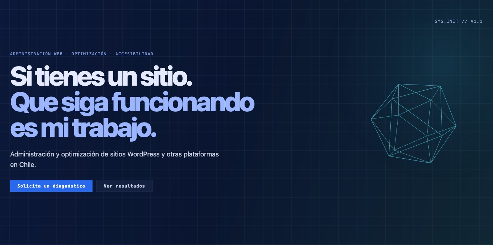

# germanriveros.cl

Business website for a web **administration, maintenance, optimization, and
accessibility** service — built with Astro.

This is not a from-scratch web development portfolio. The positioning is
deliberate: the target audience already has a website (WordPress, Magento, or
another platform) and needs someone to keep it running, updated, secure, fast,
and accessible. Every piece of copy on the site is written against that
premise.

## Live site

**https://germanriveros.cl**

## Screenshot



## Tech stack

* **Astro 7** — static output, zero client-side JS by default
* **Vanilla CSS** — no framework; design tokens are literal hex values
  documented inline (see `src/styles/global.css`)
* **TypeScript** — via Astro's `strict` tsconfig, type-checking component
  frontmatter (no dedicated `.ts` application code yet)
* **Vanilla Three.js** — used directly, without React or
  `@react-three/fiber`/`drei`, specifically to avoid adding a second UI
  framework for one decorative element on a site that also promotes
  performance as a service. See "The hero's 3D element" below.
* **GitHub Actions → GitHub Pages**, custom domain via Cloudflare

## Design principles

Accessibility and performance aren't described as generic bullet points —
they're enforced in the code, with the reasoning documented inline:

* Every interactive component has `:focus-visible` styles that mirror
  `:hover`, so keyboard users get the same information mouse users do.
* `prefers-reduced-motion` is respected across animated elements, including
  the hero's 3D icosahedron (falls back to a static frame).
* Color pairs are validated against WCAG AA (4.5:1 for body text) rather than
  chosen by eye — this caught a real bug during development (a decorative
  label at 35% opacity that read fine on the site's dark background but
  failed contrast, and separately became invisible when reused on a light
  background for the logo).
* Mobile tap targets meet the 44px minimum on primary CTAs.

Brand voice, tone, and visual language are documented in `docs/BRAND.md` /
`docs/BRAND_ES.md` and `docs/WEB_STYLE_GUIDE_germanriveros_v1.0.md`.

## The hero's 3D element

The wireframe icosahedron in the hero is rendered with **vanilla Three.js**
(`src/scripts/hero-icosaedro.js`), not the React/`@react-three/fiber` version
used for prototyping in the
[`experimentos-threejs`](https://github.com/german-rs/experimentos-threejs)
repo. That was a deliberate trade-off, not an oversight: this project has no
other React dependency, and pulling in React + fiber + drei for one
decorative shape would work against the site's own performance positioning.

It's desktop-only (hidden below 761px, where there's no layout space for it
anyway), transparent-background so it composites into the existing ambient
glow, and respects `prefers-reduced-motion`.

**Known trade-off:** even as vanilla Three.js, the bundle currently trips
Vite's 500kB chunk-size warning on build. Not yet addressed — a reasonable
next step is code-splitting so it's only loaded when the hero is in view.

## Project structure

```text
src/
├── components/
│   ├── Hero/
│   │   └── Hero.astro
│   ├── Work/
│   │   ├── Work.astro
│   │   └── WorkCard.astro   
│   ├── Services/
│   │   ├── Services.astro
│   │   └── ServiceCard.astro
│   ├── About/
│   │   └── About.astro
│   └── Contact/
│       └── Contact.astro
├── pages/
│   └── index.astro
├── scripts/
│   └── hero-icosaedro.js
└── styles/
    ├── global.css
    ├── Hero.css
    ├── Work.css
    ├── Services.css
    ├── About.css
    └── Contact.css

public/
├── favicon.svg
├── favicon.ico
└── images/
    └── germanriveros.cl.jpg

docs/
├── BRAND.md
├── BRAND_ES.md
├── ARCHITECTURE.md                        # currently empty
├── WEB_STYLE_GUIDE_germanriveros_v1.0.md
└── screenshots/
    └── hero-german-riveros.jpg

.github/
└── workflows/
    └── deploy.yml
```

## Development

Clone the repository:

```bash
git clone https://github.com/german-rs/portafolio.git
```

Install dependencies:

```bash
npm install
```

Start the development server:

```bash
npm run dev
```

Build for production — **run this before pushing**, not just `dev`. The dev
server doesn't catch case-sensitive import errors that only surface on
Linux-based CI (this has happened before: a `@import` referenced `work.css`
while the real file was `Work.css`, which builds fine on macOS/Windows but
fails on GitHub Actions):

```bash
npm run build
```

Preview the production build:

```bash
npm run preview
```

## Deployment

Deployed automatically via **GitHub Actions** (`.github/workflows/deploy.yml`)
to **GitHub Pages**, served through **Cloudflare** on a custom domain. Every
push to `main` triggers a new build and deploy.

## Status / honest roadmap

* [x] Hero section — copy, contrast-checked palette, 3D icosahedron
* [x] Work section — project list, accessible card pattern, live-status indicator
* [x] Favicon / logo 
* [x] Services section — administration, optimization, technical SEO, and
      accessibility offerings
* [X] About section — built
* [x] Contact section — availability status, response-time facts, contact
      links
* [ ] `docs/ARCHITECTURE.md` — file exists, still empty
* [ ] Code-splitting for the Three.js bundle (500kB build warning)
* [ ] Blog

## License

MIT